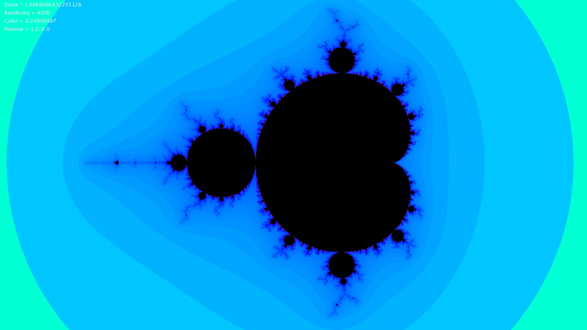
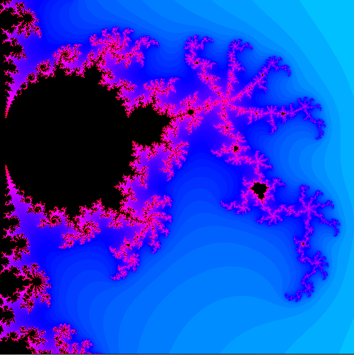
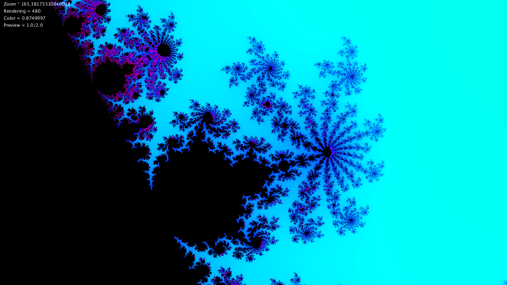
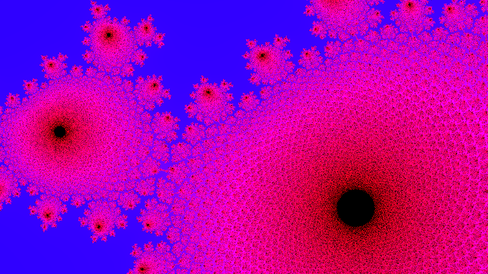

# Mandelbrot
Program napisany w Javie w środowisku graficznym Processing.  
Aby go skompilować wymagane jest środowisko.  
  
Program jest implementacją jednego z najbardziej znanych  
fraktli: zbioru Mandelbrota (żuka Mandelbrota).  
  
Program jest zainspirowany filmem Daniela Shiffmana:  
https://www.youtube.com/watch?v=6z7GQewK-Ks  
Więcej o zbiorze Mandelbrota:  
https://pl.wikipedia.org/wiki/Zbiór_Mandelbrota  
  
Poza podstawowym działaniem program posiada parę funkcji dostępnych z poziomu klawiatury:  
- zmiana dokładności próbkowania (GÓRA/DÓŁ - duży skok ; LEWO/PRAWO - mały skok)  
- tryb podglądu (SPACJA - on/off ; -/+ - zmiana dokładności podglądu)  
- printScreen (ENTER)  
- zmiana skalowania kolorów ( [ / ] )  
- ukrywanie napisów (t);
  
Na ekranie widoczny jest podgląd powyższych parametrów.  

Przykładowe kadry:
  
  
  
  
